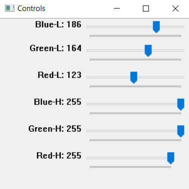

<h1>How to use the Ball Bound detecting programs </h1>
This section will go over how to use the ball bounding detectors. This will probably be intergrated into the final code as well but it's still helpful and lets me make this section into a discrete model reducing the amount of features I need to add once.

<h2> HSV or BGR </h2>
This will entirely depend on the colour of the ball using,the backdrop, the ground(pitch) under the ball. So I reccomend trying both and using the best one of the two. 

<h2>How to use</h2>
As you will see there is a control panel: 

Simpily adjust the minimum and maximum values until the ball is the main item you can see in the frame and it continues to be as the video returns through. The goal is to make so the ball is the only thing you can see. But don't worry about small false positivies as theese are filtered out during the contour detection process.

I would recomend the following steps to help you:
<ol>
  <li>Focus on the bitwise/masked (bitwised is easier) when adjusting it.</li>
  <li>Start adjusting the maximums first and drag the slider all the way until the ball starts to dissapear</li>
  <li> Remember you can crop out parts of the frame if you know the ball will never go there (e.g. behind the wicket or super high in  the air).</li>
  <ul><li><b>Only if the ball path will never cross there so you don't loose tracking data when the ball is on it's path</b></li></ul>
</ol>
